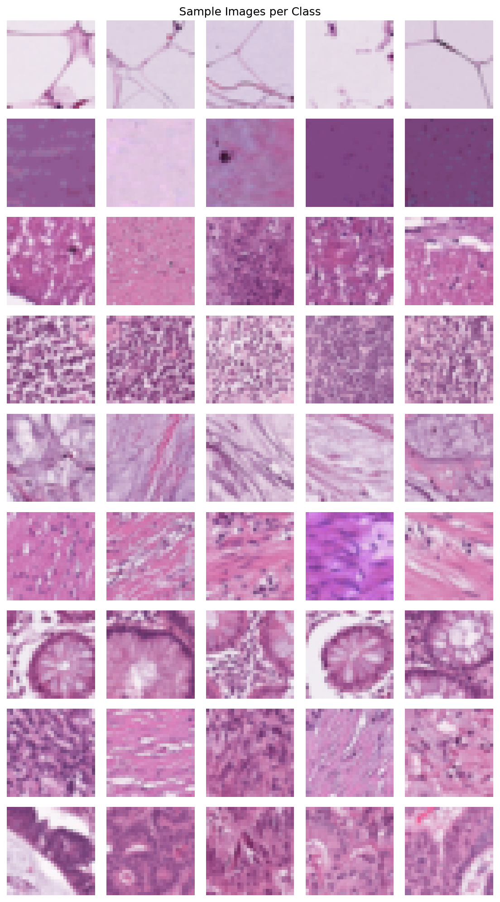
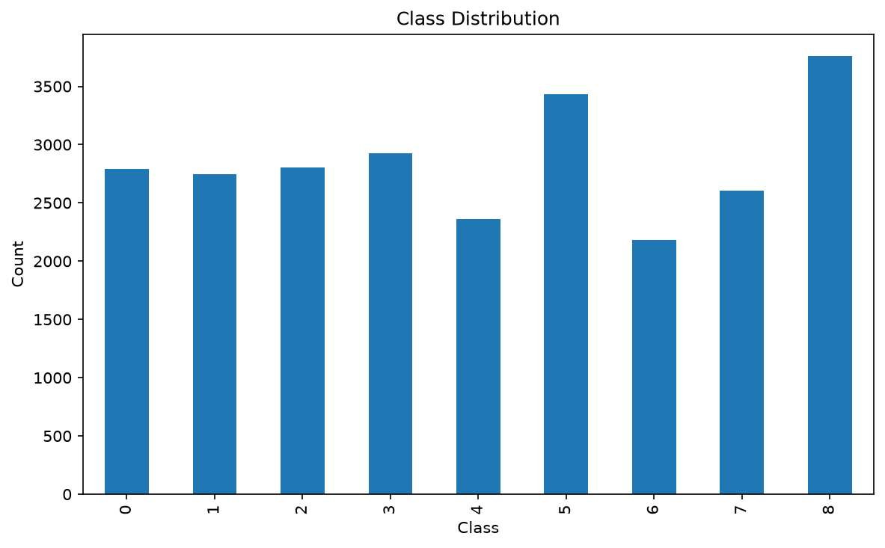
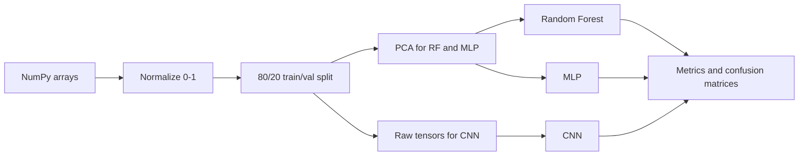
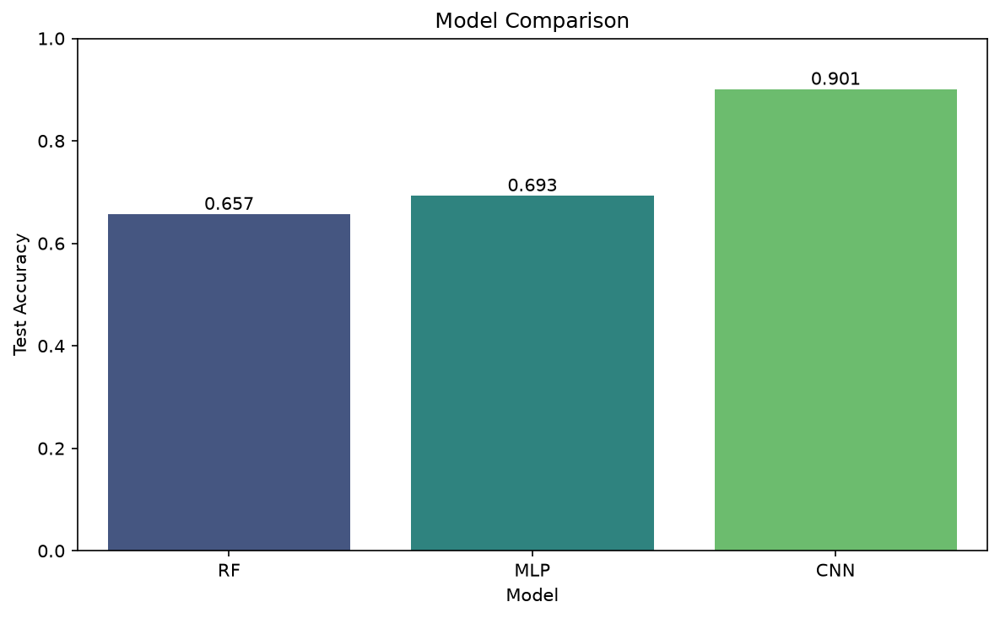
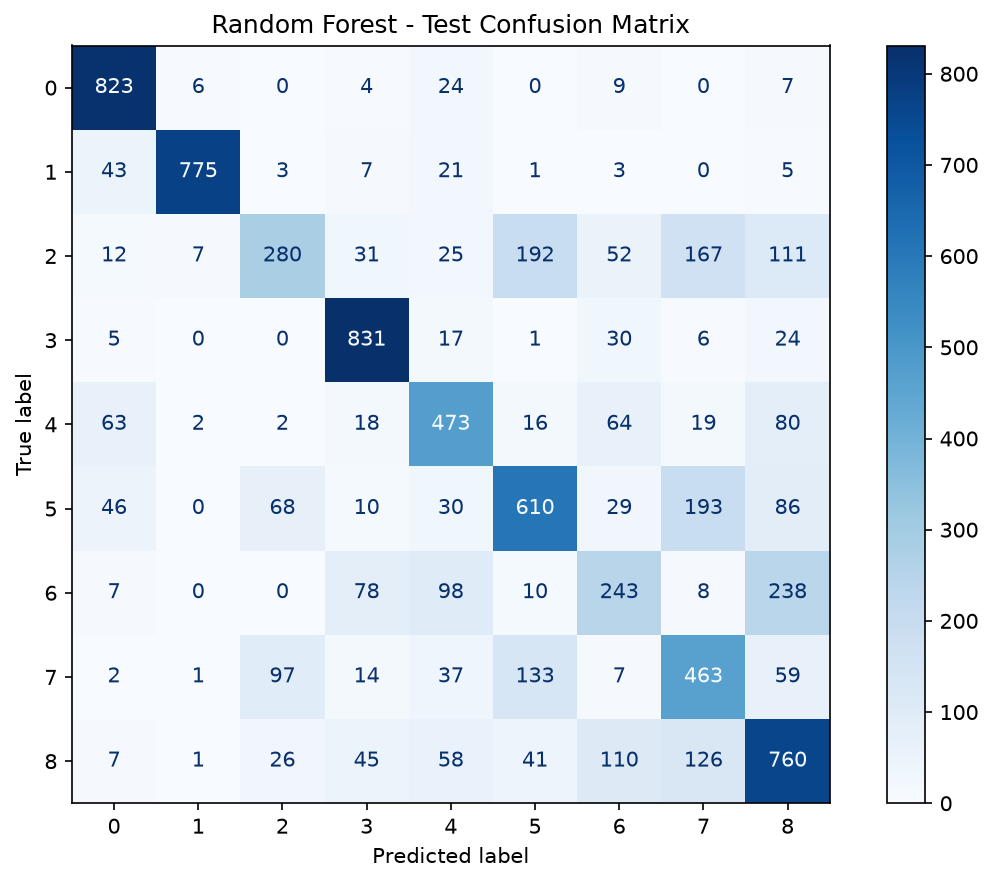
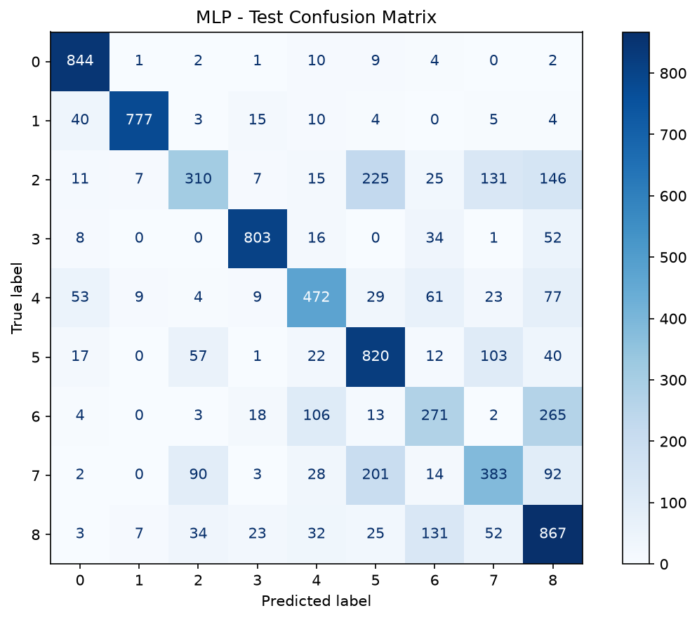
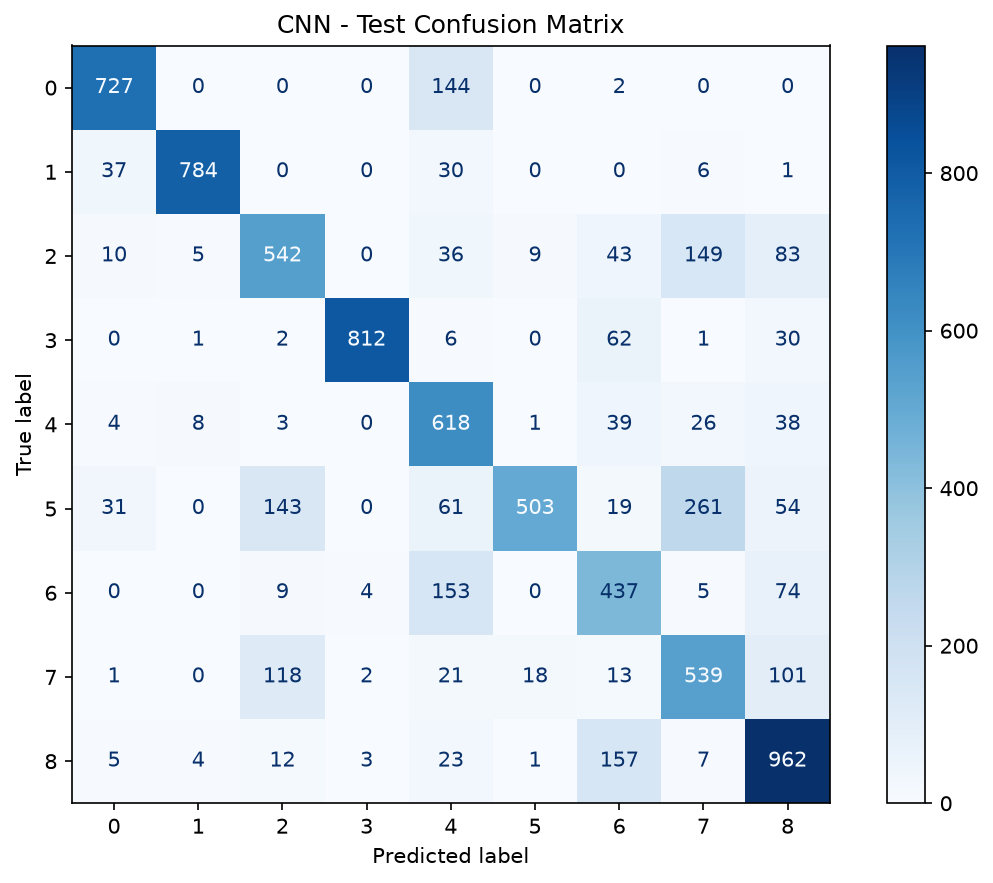

# Medical Image Classification — Portfolio Showcase

> **Histopathology image classification** comparing Random Forest, MLP, and CNN on a 9-class medical imaging dataset. Best model (CNN) achieves **90.1% test accuracy** (CLI baseline: RF GridSearch, MLP `--cpu-only`, CNN on GPU).

| Model | Test Accuracy | Training Cost | Best Hyperparameters |
|-------|---------------|---------------|----------------------|
| Random Forest (PCA) | 65.7% | Low | `n_estimators=250`, `max_depth=20`, `max_features=sqrt` (GridSearch default; `--no-tune` fallback) |
| MLP (PCA) | 69.3% | Medium | `units=256`, `relu`, `dropout=0.2`, `lr=0.1` |
| **CNN** | **90.1%** | High | `filters=(32,64)`, `kernels=(3,5)`, `dense=64`, `dropout=0.3` |

---

## Problem & Motivation

Automated classification of histopathological tissue images supports computer-aided diagnosis (CAD) in digital pathology. This project systematically compares classical machine learning and deep learning approaches to identify the most effective model for multi-class tissue classification.

**Goals:**
- Compare model families on identical data and metrics
- Tune hyperparameters with structured search (RF GridSearch; optional CNN keras-tuner)
- Evaluate generalization on a held-out test set

---

## Dataset

| Split | Samples | Format |
|-------|---------|--------|
| Training | 32,000 | 28×28 RGB (`uint8`, 0–255) |
| Test | 8,000 | 28×28 RGB |

- **9 classes** — tissue types including adipose, tumor, muscle, glandular, stromal, and background
- **Balanced** class distribution (no resampling required)
- **Preprocessing:** pixel normalization to [0, 1]; PCA (95% variance, ~330 components) for RF/MLP only





---

## Approach Overview



Three model families share the same evaluation pipeline (accuracy, F1, precision/recall, confusion matrices) but differ in feature representation:

| Model | Input features | Key idea |
|-------|----------------|----------|
| Random Forest | PCA-reduced vectors | Ensemble of decision trees; fast, interpretable baseline |
| MLP | PCA-reduced vectors | Non-linear fully connected network |
| CNN | Raw 28×28×3 images | Spatial convolutions capture texture and structure |

---

## Methods

### Random Forest

- **Theory:** Bagged ensemble of decision trees with random feature subsets at each split
- **Tuning:** `GridSearchCV` with 3-fold stratified CV over `n_estimators`, `max_depth`, `max_features` (cached to `outputs/tuning/rf/best_params.json`)
- **Fallback (`--no-tune`):** 250 trees, `max_depth=20`, `sqrt` features
- **Strengths:** Fast training, feature importance, robust baseline
- **Limitations:** Struggles with visually similar tissue classes after PCA compression

### MLP (Multi-Layer Perceptron)

- **Architecture:** 2 hidden layers (256 units, ReLU) + dropout 0.2 on PCA features
- **Optimizer:** SGD with learning rate 0.1
- **Tuning:** Fixed best-known params from notebook search (CLI has no MLP tuner)
- **Result:** 69.3% test accuracy — moderate performance, lacks spatial awareness
- **Apple Silicon:** run with `--cpu-only`; GPU + mixed precision breaks SGD at `lr=0.1`

### CNN (Convolutional Neural Network)

- **Architecture:** Conv2D(32,3) → Conv2D(64,5) → MaxPool → GlobalAvgPool → Dense(64) → Softmax
- **Regularization:** L2 (1e-4), BatchNorm, Dropout (0.3), EarlyStopping, ReduceLROnPlateau
- **Tuning:** Fixed `BEST_CNN_PARAMS` by default; optional `--tune` runs keras-tuner (not used for reported 90.1%)
- **Result:** **90.1% test accuracy** — best at capturing spatial patterns in tissue images (GPU recommended)

---

## Results



| Model | Accuracy | F1 (weighted) | Interpretability | Speed |
|-------|----------|---------------|------------------|-------|
| PCA + RF | 0.657 | 0.649 | High | Fast |
| PCA + MLP | 0.693 | 0.685 | Medium | Medium |
| **CNN** | **0.901** | **0.901** | Low | Slow |

**Key findings:**
- CNN significantly outperforms classical and fully-connected approaches on raw image tensors
- RF is a useful interpretable baseline but confuses visually similar classes (2, 6, 7)
- MLP bridges the gap but cannot match CNN without spatial feature learning
- RF GridSearch is cached; MLP/CNN use fixed params unless `--tune` (CNN only)

Confusion matrices and training curves are generated automatically when running the CLI (see `outputs/figures/`).







---

## Key Takeaways (Transferable Skills)

- End-to-end ML pipeline: data loading → preprocessing → model training → evaluation → artifact export
- Hyperparameter tuning strategies: GridSearch (RF, cached), fixed params (MLP/CNN), optional keras-tuner (`--tune` for CNN)
- Medical imaging specifics: PCA for tabular models vs. raw tensors for CNNs
- Reproducible project structure: Python package, CLI entry points, versioned dependencies

---

## Tech Stack

- **Python 3.12** · NumPy · Pandas · scikit-learn · TensorFlow/Keras · keras-tuner · Matplotlib · Seaborn

---

## How to Reproduce

```bash
# Setup (requires Python 3.10–3.12 for TensorFlow)
./scripts/setup_venv.sh          # or: pip install -e ".[dev,macos]" on Apple Silicon
source .venv/bin/activate

# Quick smoke test
medimg-train --model all --quick

# Full training — recommended on Apple Silicon (MLP needs CPU; CNN uses GPU)
medimg-train --model rf
medimg-train --model mlp --cpu-only
medimg-train --model cnn

# Alternative: single command (RF GridSearch + fixed MLP/CNN; MLP may fail on GPU)
medimg-train --model all

# Skip RF GridSearch; use fixed params
medimg-train --model rf --no-tune

# Optional keras-tuner search (different architecture than baseline 90.1% config)
medimg-train --model cnn --tune
```

See the [project README](../README.md) for full directory layout.

---

## Future Work

- Attention mechanisms or residual connections for finer texture discrimination
- Grad-CAM for model interpretability in clinical settings
- Bayesian optimization for more efficient hyperparameter search

---

## References

- Keras Team. Keras API reference. https://keras.io/api/
- Goodfellow, I., Bengio, Y., & Courville, A. (2016). *Deep Learning*. MIT Press.
- LeCun, Y., Bengio, Y., & Hinton, G. (2015). Deep learning. *Nature*, 521(7553), 436–444.
- Hornik, K., Stinchcombe, M., & White, H. (1989). Multilayer feedforward networks are universal approximators. *Neural Networks*, 2(5), 359–366.

---

*Course context: COMP5318/4318 Machine Learning (University of Sydney, 2024). Original notebook and PDF report are archived in [`archive/`](../archive/).*
